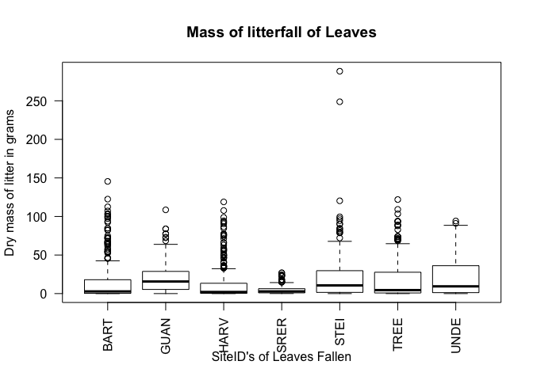
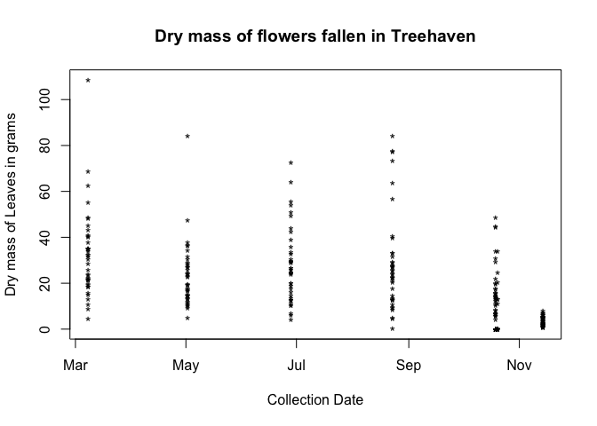

HW4 Rmarkdown and Litterfall Module Synthesis
================
Courtney Lopez
2/22/2018

Introduction
============

The National Ecological Observatory Network (NEON) is an ecological observation facility that collects data on rapidly changing ecological processes in the United States. NEON has standardized data from 81 field sites that span across the United States within 20 eco-climatic domains that represent regions of distinct land forms, vegetation, climate, and ecosystem dynamics. NEON measures the causes and effects of environmental change in different types of environments.

The different types of field sites include core terrestrial sites, core aquatic sites, relocatable terrestrial sites, and relocatable aquatic sites. The different sites ensure that the data will statistically represent ecological, physical, and biological differences spanning the continent. As seen from the image below, the field sites are also in Alaska, Hawaii, and Puerto Rico. This image shows where the NEON sites are located including where the four different types of sites are located.


At the varying sites multiple different functional groups of dry mass are recorded depending the location of the site. This includes dry mass of flowers, leaves, mixed, needles, other, seeds, twigs/branches, and woody material. The sites that I will be focusing on for this analysis are the terrestrial sites. Specifically, I will be focusing on the dry mass of leaves at the terrestrial sites of Bartlett Experimental Forest (BART), Guanica Forest (GUAN), Harvard Forest (HARV), Santa Rita Experimental Range (SRER), Steigerwaldt Land Services (STEI), Treehaven (TREE), and UNDERC (UNDE). I also chose to do a more in depth analysis of the GUAN dry mass of leaves, and look at what time of the year had the most and the least amount dry mass.

Understanding this data is important because it can be used by scientists, researchers, professors, and students to gain knowledge about ecological differences between different environments on recent ongoing data collection.

(<http://www.neonscience.org>)

Methods
=======

The data collected at the sites is called litterfall. This data of litter and leaves is collected from each site by field sampling techniques, and sensor-derived airborne remote methods at different scales. This includes collecting data from elevated areas, ground traps, and single collection events. Mass data was collected using different functional groups which includes, leaves, needles, twigs/branches, woody material, seeds, flowers, lichen/other, and mixed. This data is used to estimate annual Above ground Net Primary Productivity (ANPP) and biomass at the sites. Also, it can be used to understand vegetative carbon fluxes over time. We are analyzing this data using R to create a box plot, ANOVA test, and scatter plot to determine if there are significant differences of the dry mass of leaves at the varying sites.

Results
=======

``` r
# read in litterfall data
litterfall_data <- read.csv("data/ltr_massdata.csv",
                            header = TRUE)
```

``` r
# subset litterfall data to only show leaves
leaves <- subset(litterfall_data,
                 functionalGroup == "Leaves")
```

``` r
# mass of litter by functional type
boxplot(dryMass ~ siteID,
        data = leaves,
        main = "Mass of litterfall of Leaves",
        xlab = "SiteID's of Leaves Fallen",
        ylab = "Dry mass of litter in grams",
        las = 2)
```



``` r
# test for significance between the groups
anova(lm(dryMass ~ siteID,
         data = leaves))
```

    ## Analysis of Variance Table
    ## 
    ## Response: dryMass
    ##             Df  Sum Sq Mean Sq F value    Pr(>F)    
    ## siteID       6   52692  8782.0  14.839 < 2.2e-16 ***
    ## Residuals 1735 1026795   591.8                      
    ## ---
    ## Signif. codes:  0 '***' 0.001 '**' 0.01 '*' 0.05 '.' 0.1 ' ' 1

A statistical test of an ANOVA was used to determine if there is a significant difference of leaves fallen between the seven sites used in the box plot. The null hypothesis for an ANOVA test is there is no significant difference between the dry mass value of leaves fallen at each site. When we visualize the numbers from the ANOVA test, we see that there is a significant difference and we reject the null hypothesis. The ANOVA test came up with a P value less than &lt;0.05. (ANOVA p = 2.2e-16).

``` r
# subset a certain target site for leaves
guan_data <- subset(leaves,
                    siteID == "GUAN")
```

``` r
# make a scatterplot of leaves at "GUAN"
plot(x = as.POSIXct(guan_data$collectDate),
     y = guan_data$dryMass,
     main = "Dry mass of flowers fallen in Treehaven",
     xlab = "Collection Date",
     ylab = "Dry mass of Leaves in grams",
     pch = "*")
```



Discussion
==========

Analyzing the dry mass of leaves fallen from the seven sites of Bartlett Experimental Forest (BART), Guanica Forest (GUAN), Harvard Forest (HARV), Santa Rita Experimental Range (SRER), Steigerwaldt Land Services (STEI), Treehaven (TREE), and UNDERC (UNDE) showed many interesting findings. From looking at the box plot, there did not seem to be a big difference in leaf fall between the sites. Overall, it shows that GUAN and UNDE has the most amount of dry mass of leaves than the other sites. The site with the least amour of dry mass of leaves is SRER. The predominant types of vegetation in these locations and temperature/weather has a big impact of the amount of leaves that fall. SRER site is located in Arizona, while GUAN is located in Puerto Rico and UNDE is located in Missouri. The primary vegetation at SRER is a mix of short trees, shrubs, cacti and other succulents, perennial grasses, and other herbaceous species. The primary vegetation in Puerto Rico is an evergreen forest with herbaceous productivity, and vegetation structure. The primary vegetation in Missouri is "second-growth Northern mesic forest with dominant species including, red and sugar maple (Acer rubrum and A. saccharum), aspen (Populus tremuloides and P. grandidentata) and paper birch (Betula papyrifera)". Also, this site contains poorly drained soil which contributes to many other species that are created in this area. The climate in Arizona is a lot hotter than the climates in Puerto Rico and Missouri. These factors contribute to its lack of leaves. There are less leaves falling in Arizona, because the habitat is primarily desert so the trees are therefore barren. Furthermore, the statistical ANOVA test concluded that there is a significant difference between leaves dry mass at all seven sites with a P value of 2.2e-16.

A more in depth analysis of the GUAN site of dry mass of leaves was also conducted and looked at. The scatter plot shows there is a high abundance of dry mass about every other month. The leaves seem to fall about every other month, which contributes to the high amount of leaves fallen overall compared to the other sites. The highest amount of dry mass collected is about 100 g in the beginning of April, which could be because the season time. Even though the NEON website doesn't say much about the GUAN site, this difference in leaf fall could be that the plant has a fast growing cycle, and nutrients that the tree produces many leaves. Also, the plants that grow at this site could be bigger than other sites. These results indicate that the flow of Carbon and Nitrogen from the autotrophic biota and into the soil is a lot greater than comparison to the other sites. The soil is richer and this modifies its environment to be healthy and grow a more vast varieties of things. The leaves have a less carbon to nitrogen ration than flowers, therefore the leaves are prone to falling off more and quicker.
